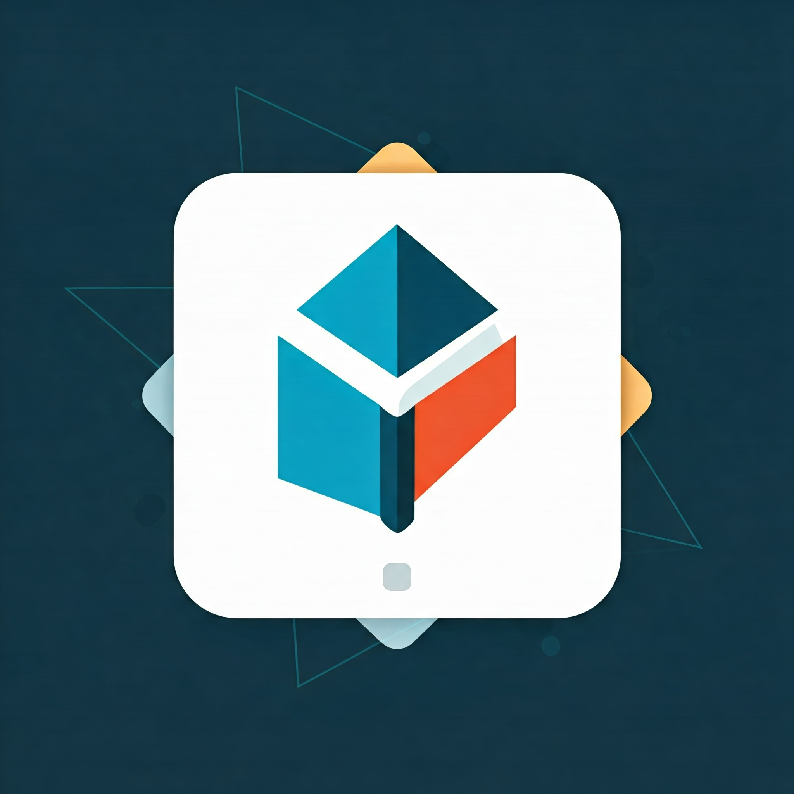

# FLUI Kit

A modern library of reusable components and screens for Flutter, designed to accelerate mobile application development with consistent design.

## 📦 Installation

Add this dependency to your `pubspec.yaml` file:

```yaml
dependencies:
  flui_kit: ^0.0.1
```

Then run:

```bash
flutter pub get
```

## 🎯 Features

- Rich collection of reusable UI components
- Pre-built screens for common use cases
- Customizable and consistent themes
- Full dark mode support
- Performance-optimized components
- Detailed documentation and usage examples

## 🛠️ Available Components

All components can be found at [FluiKit Components](https://fluikit.maeltoukap.me).

### Custom Components

- Card plan switcher

## 💡 Usage

```dart
import 'package:flui_kit/flui_kit.dart';

// Button usage example
FluiButton(
  text: 'Login',
  onPressed: () {
    // Action
  },
)

// Login screen usage example
FluiLoginScreen(
  onLogin: (email, password) async {
    // Login logic
  },
)
```

## 🎨 Customization

The kit supports full customization via ThemeData:

```dart
FluiTheme(
  data: FluiThemeData(
    primaryColor: Colors.blue,
    secondaryColor: Colors.green,
    // Other configurations...
  ),
  child: YourApp(),
)
```

## 📱 Examples

Check out the `example` folder for complete implementations and use cases.

## 🤝 Contributing

Contributions are welcome! Please read our contribution guidelines for more details.

1. Fork the project
2. Create your feature branch (`git checkout -b feature/AmazingFeature`)
3. Commit your changes (`git commit -m 'Add some AmazingFeature'`)
4. Push to the branch (`git push origin feature/AmazingFeature`)
5. Open a Pull Request

## 📄 License

Distributed under the MIT License. See `LICENSE` for more information.

## 📧 Contact

For any questions or suggestions, feel free to open an issue or contact us directly.

- Email: <devmael09@gmail.com>
- Twitter: [@flui_kit](https://x.com/maeltoukap)
- Website: [https://fluikit.maeltoukap.me](https://fluikit.maeltoukap.me)

---

Made with ❤️ by your team
